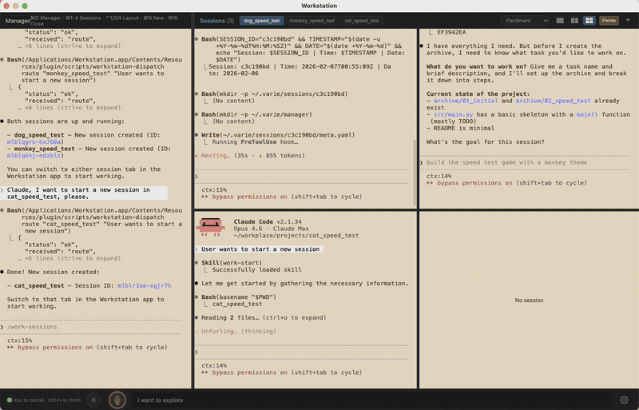
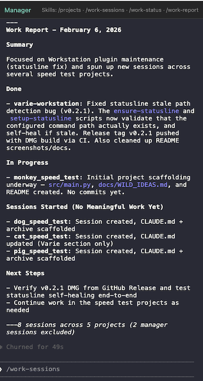
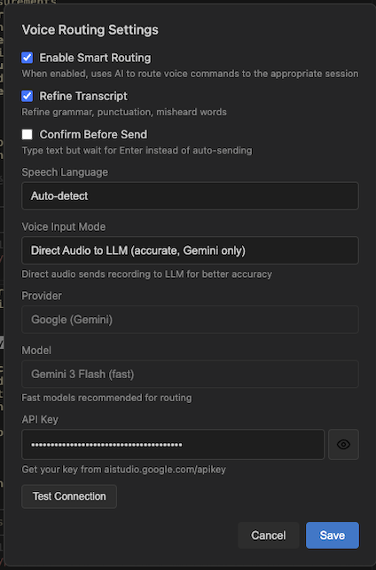

# Workstation

Multi-session orchestration for Claude Code with voice control.



<p>
  
  
</p>

*Work reports for standups · Voice routing settings*

Built for those who love to build.

---

## Features

### Session Management & Orchestration
- **Multi-session terminals** — Run multiple Claude Code sessions side-by-side
- **Smart routing** — Auto-dispatch commands to the right session by repo name, task ID, or context
- **Manager session** — Central terminal for cross-project commands
- **Project discovery** — Auto-detect repos and track work progress

### Project Management
- **Work reports** — Generate human-readable summaries for standups, team syncs, and manager updates
- **Checkpoints** — Save and resume structured work state across sessions
- **Handover docs** — Session handovers with resume prompts so nothing gets lost

### Voice Control
- **Apple Speech** — Fast, offline speech recognition (macOS)
- **LLM-powered routing** — Gemini/Claude/GPT transcribes and routes voice commands to the right session
- **Hands-free dispatch** — Speak naturally: "continue the character API work"

## Installation

**Requirements:** macOS 12+, [Claude Code CLI](https://docs.anthropic.com/en/docs/claude-code)

### Option A: Download the app (recommended)

The desktop app bundles the plugin — no separate plugin install needed.

1. Download from [GitHub Releases](https://github.com/varie-ai/workstation/releases):
   - **macOS (Apple Silicon):** `*-arm64.dmg`
   - **macOS (Intel):** `*-x64.dmg`

2. Open the DMG and drag **Workstation** to Applications.

3. Launch the app. All Claude Code sessions started from Workstation automatically have the plugin skills available.

> **macOS Gatekeeper:** If macOS blocks the app on first launch:
> - **macOS 14 and earlier:** Right-click the app > Open > click Open
> - **macOS 15 (Sequoia):** System Settings > Privacy & Security > "Open Anyway"

### Option B: Install the plugin first

If you prefer to start with the Claude Code plugin (adds skills to standalone Claude Code sessions too):

```
/plugin marketplace add https://github.com/varie-ai/workstation
/plugin install varie-workstation@varie-workstation
```

Restart Claude Code. The Workstation app downloads and launches automatically on your next session. To disable: `/workstation autolaunch off`

### Build from source

```bash
git clone https://github.com/varie-ai/workstation.git
cd workstation
npm install
npm run dev
```

## Privacy

Workstation runs entirely on your machine. No telemetry, no analytics, no data sent to any third party.

- **All state is local** — Checkpoints, session data, and configuration live in `~/.varie/` on your filesystem. Nothing is synced or uploaded.
- **Voice (Apple Speech)** — Processed on-device by macOS. Audio never leaves your machine.
- **LLM smart routing (opt-in)** — If you enable voice routing via an LLM provider (Gemini, Claude, GPT), your voice transcript and project repo names are sent to the provider you choose, using your own API key. This feature is off by default.

## Quick Start

### Session Workflow
```bash
# From Manager terminal
/work-sessions          # See all active sessions
/route "my-app" "fix the auth bug"  # Route to matching session
/dispatch abc123 "run tests"       # Send to specific session

# From any session
/work-start myrepo feature-x       # Start tracking work
/work-checkpoint                   # Save progress
/work-report                       # Generate standup summary
/work-handover                     # Generate handover doc
```

### Voice Control Setup
1. Click the gear icon in Workstation
2. Select your speech engine and voice routing mode
3. Enter your API key (if using Gemini)
4. Press **Ctrl+V** or click the mic to speak

| Engine | Speed | Accuracy | Offline | Notes |
|--------|-------|----------|---------|-------|
| WhisperKit | Fast | Excellent | Yes | **Recommended for Apple Silicon.** Defaults to `base` model; we recommend selecting `large-v3-turbo` for best accuracy (~1 min first-time download + compile, ~1s load thereafter). |
| Apple Speech | Fast | Good | Yes | Built-in macOS speech recognition. No setup required. |
| Direct Audio (Gemini) | Medium | Excellent | No | Requires Gemini API key. Best for non-Apple Silicon machines. |

macOS will prompt for **Microphone** and **Speech Recognition** permissions on first use.

## Skills Reference

| Skill | Description |
|-------|-------------|
| `/work-start` | Initialize task tracking with context loading |
| `/work-checkpoint` | Save structured work state |
| `/work-resume` | Resume previous work via fuzzy matching |
| `/work-recover` | Compare checkpoint vs reality after crash |
| `/work-status` | Show all active tasks across repos |
| `/work-report` | Generate work reports for standups and team syncs |
| `/work-handover` | Generate session handover documentation |
| `/work-summarize` | Quick summary of current session state |
| `/work-sessions` | List all active sessions |
| `/work-stats` | Show token usage statistics |
| `/route` | Auto-route message to best matching session |
| `/dispatch` | Send message to specific session by ID |
| `/projects` | Show all projects with status |
| `/project` | Deep dive into a specific project |
| `/discover-projects` | Scan for new repos and add to index |
| `/workstation` | Configure settings (autoLaunch, skip-permissions) |

## Configuration

```yaml
# ~/.varie/config.yaml
autoLaunch: true  # Auto-start with Claude Code
```

LLM/voice settings are managed through the in-app settings panel.

## Development

```bash
npm install       # Install dependencies
npm run dev       # Development mode (Electron)
npm run test      # Run tests
npm run package:mac  # Build for distribution
```

## License

MIT

---

[GitHub](https://github.com/varie-ai/workstation) · [Varie AI](https://varie.ai)
