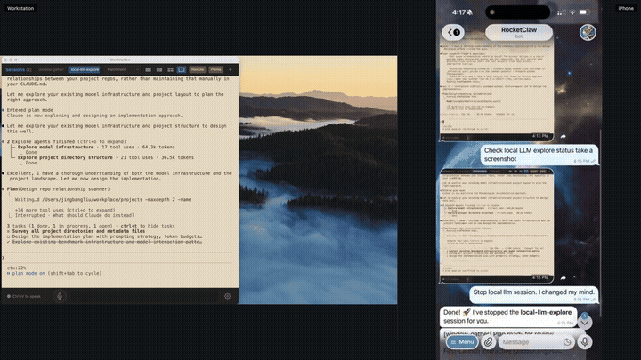

# Workstation

Control Claude Code from your phone. An agentic coding orchestrator with AI agent integration, voice control, and multi-session management.



Connect an AI agent like [OpenClaw](https://openclaw.ai) to dispatch commands, approve plans, and monitor progress from Telegram or WhatsApp — while your Mac codes autonomously. Pair with native voice control for a completely hands-free coding experience.

---

## Table of Contents

- [Features](#features)
- [Installation](#installation)
- [macOS Permissions](#macos-permissions)
- [Agent Integration (OpenClaw)](#agent-integration-openclaw)
  - [Quick Start](#agent-quick-start)
  - [How It Works](#how-it-works)
  - [Remote Mode & Notifications](#remote-mode--notifications)
  - [Interacting from Your Phone](#interacting-from-your-phone)
  - [On-Demand Screenshots](#on-demand-screenshots)
  - [Troubleshooting](#agent-troubleshooting)
- [Voice Control](#voice-control)
- [Session Management](#session-management)
- [Skills Reference](#skills-reference)
- [Privacy](#privacy)
- [Configuration](#configuration)
- [Development](#development)

---

## Features

### AI Agent Integration
- **Phone-first control** — Dispatch commands, approve plans, and answer questions from Telegram or WhatsApp
- **Auto-readiness tracking** — Sessions wait for Claude to be ready before dispatching, so messages never get lost
- **Live notifications** — Get notified when Claude finishes, asks a question, or needs plan approval — with screenshots
- **Natural language routing** — *"run tests in my-app"* routes to the right session automatically

### Voice Control
- **Hands-free coding** — Speak commands and they route to the right session
- **WhisperKit + Apple Speech** — Fast, offline speech recognition on Apple Silicon
- **Project-aware vocabulary** — WhisperKit biases transcription toward your project names for better accuracy
- **LLM-powered routing** — Gemini/Claude/GPT interprets intent and dispatches to the correct session

### Session Management & Orchestration
- **Multi-session terminals** — Run multiple Claude Code sessions side-by-side
- **Smart routing** — Auto-dispatch commands by repo name, task ID, or context
- **Manager session** — Central terminal for cross-project commands
- **Work reports** — Generate summaries for standups, team syncs, and handovers
- **Checkpoints** — Save and resume structured work state across sessions

---

## Installation

**Requirements:** macOS 12+, [Claude Code CLI](https://docs.anthropic.com/en/docs/claude-code)

### Option A: Download the app (recommended)

The desktop app bundles the plugin — no separate plugin install needed.

1. Download from [GitHub Releases](https://github.com/varie-ai/workstation/releases):
   - **macOS (Apple Silicon):** `*-arm64.dmg`
   - **macOS (Intel):** `*-x64.dmg`

2. Open the DMG and drag **Workstation** to Applications.

3. Launch the app. All Claude Code sessions started from Workstation automatically have the plugin skills available.

> **macOS Gatekeeper:** If macOS blocks the app on first launch:
> - **macOS 14 and earlier:** Right-click the app > Open > click Open
> - **macOS 15 (Sequoia):** System Settings > Privacy & Security > "Open Anyway"

### Option B: Install the plugin first

If you prefer to start with the Claude Code plugin (adds skills to standalone Claude Code sessions too):

```
/plugin marketplace add https://github.com/varie-ai/workstation
/plugin install varie-workstation@varie-workstation
```

Restart Claude Code. The Workstation app downloads and launches automatically on your next session. To disable: `/workstation autolaunch off`

### Build from source

```bash
git clone https://github.com/varie-ai/workstation.git
cd workstation
npm install
npm run dev
```

---

## macOS Permissions

Workstation uses native macOS capabilities that require your explicit approval. macOS will show permission prompts on first use — here's what they are and why they're needed.

| Permission | When prompted | Why it's needed |
|-----------|---------------|-----------------|
| **Accessibility** | First launch | Required for Workstation to manage terminal sessions and capture keyboard shortcuts (voice control hotkey, etc.) |
| **Microphone** | First voice command | Voice control needs mic access for speech recognition. All audio is processed on-device. |
| **Speech Recognition** | First voice command | Apple Speech engine requires this system permission. Audio stays on your Mac. |
| **Screen Recording** | When using full-screen screenshots | Only needed if you want the agent to capture your entire display (not just the Workstation window). Session-mode screenshots use Electron's built-in capture and need no extra permission. |

**To manage permissions:** System Settings > Privacy & Security > select the permission category > enable/disable Workstation.

> **Why so many prompts?** macOS requires separate consent for each capability. Workstation asks only when a feature is actually used — you won't see a microphone prompt unless you activate voice control, and you won't see Screen Recording unless full-screen screenshots are requested.

---

## Agent Integration (OpenClaw)

Control your Workstation sessions remotely from your phone via [OpenClaw](https://openclaw.ai) and a messaging app (Telegram or WhatsApp). Send commands, approve plans, answer questions, and get live screenshots — all from your phone while your Mac codes autonomously.

### Agent Quick Start

1. **Install OpenClaw** — `npm install -g openclaw` and start the gateway (`openclaw gateway start`)
2. **Connect a messaging channel** — Set up Telegram or WhatsApp in your OpenClaw config (`~/.openclaw/openclaw.json`)
3. **Launch Workstation** — It auto-detects OpenClaw and registers the Workstation skill
4. **Send a message** — From Telegram/WhatsApp, tell your agent something like *"check the status of my-app"*. Remote mode turns on automatically.

> **Note:** The notification bridge reads your OpenClaw channel config at launch. If you add or reconfigure a channel after Workstation is already running, relaunch Workstation so the bridge picks up the new settings.

### How It Works

```
You (Telegram/WhatsApp)
  -> OpenClaw agent (understands your intent)
    -> Workstation (matches to the right session by repo name)
      -> Claude Code (executes your request)
        -> Bridge (detects: finished, question, plan approval)
          -> OpenClaw (sends notification + screenshot to your phone)
```

Sessions are identified by their **repo/project name** (e.g. `my-app`, `backend-api`) as shown in the Workstation tab bar. You reference sessions naturally — *"run tests in my-app"* — and the agent routes to the matching session automatically.

### Remote Mode & Notifications

**Remote mode** controls whether notifications are sent to your phone.

- **Auto-enabled** — Turns on automatically when the agent dispatches or creates a session
- **Manual toggle** — Click the `Remote` button in the top bar
- Turning Remote mode off stops notifications (useful when you're back at your desk)

The built-in bridge watches your Claude Code sessions and notifies you when:

| Event | What you receive |
|-------|-----------------|
| **Claude finished** | Terminal output summary + screenshot of the result |
| **Plan approval** | Plan details with numbered options to approve/reject |
| **Question** | The question text with selectable options |

Screenshots are captured from the Workstation window using Electron's built-in page capture — no extra permissions needed.

**Choosing a notification channel:** Open Settings (gear icon) > Agent Notifications > **Notification Channel** dropdown. Select which channel (Telegram or WhatsApp) should receive notifications. The dropdown auto-populates from your OpenClaw config.

### Interacting from Your Phone

**Checking active sessions:**
- *"what sessions are running?"* — Lists all active sessions with repo name, task, and current work context

**Sending commands:**
- *"check the auth bug in my-app"* — Routes to the matching session by repo name
- *"create a new session for backend-api and fix the login bug"* — Creates a session if none exists
- You never need to know session IDs — just use the project/repo name

**Answering questions and plan approvals:**
- For simple choices (1, 2, 3...), reply with the option number
- For detailed answers, say **"chat with claude: your detailed answer here"** — types directly into the Claude Code input

**Stopping execution:**
- Say **"escape"** or **"interrupt"** to stop the current operation (equivalent to Escape or Ctrl+C)

### On-Demand Screenshots

The agent can request screenshots at any time:

| Mode | What it captures | Permission needed |
|------|-----------------|-------------------|
| **Session** (default) | The Workstation app page, focused on a specific session | None (Electron built-in) |
| **Session + pages** | Multiple pages of terminal scrollback history | None (Electron built-in) |
| **Screen** | Your entire display or a specific monitor | macOS Screen Recording |

**Multi-page scrollback:** Use `--pages N` to capture N pages of terminal output (max 10). Pages are captured oldest-first, so page 1 shows the earliest visible content and the last page shows the current viewport. Useful when Claude produces long output that scrolls past the visible area.

**Auto-screenshot after dispatch:** When you send a command to a session from your phone, Workstation automatically captures a screenshot after a short delay and sends it back — so you can see what was delivered without manually requesting a screenshot.

To enable full-screen screenshots: **System Settings > Privacy & Security > Screen Recording > enable Workstation**, then restart the app.

### Agent Troubleshooting

| Issue | Fix |
|-------|-----|
| Agent doesn't know about Workstation skill | Restart the OpenClaw gateway — skills load at startup |
| Skill still not found after restart | Relaunch Workstation so it re-registers the skill, then restart the gateway |
| No notifications received | Check Remote mode is on (green `Remote` button in top bar) |
| Screenshots missing from notifications | Notifications use Electron page capture (no permission needed). For full-screen screenshots, grant Screen Recording permission. |
| Agent routes to wrong session | Be specific with the repo name: *"run tests in varie-workstation"* |
| No notifications after setting up OpenClaw | Relaunch Workstation — the bridge reads OpenClaw channel config at startup |

---

## Voice Control

Native voice control for hands-free coding. Speak commands and they route to the correct session automatically.

### Setup

1. Click the gear icon in Workstation
2. Select your speech engine and voice routing mode
3. Enter your API key (if using an LLM provider)
4. Press **Ctrl+V** or click the mic to speak

### Speech Engines

| Engine | Speed | Accuracy | Offline | Notes |
|--------|-------|----------|---------|-------|
| WhisperKit | Fast | Excellent | Yes | **Recommended for Apple Silicon.** Defaults to `base` model; we recommend `large-v3-turbo` for best accuracy (~1 min first-time download + compile, ~1s load thereafter). |
| Apple Speech | Fast | Good | Yes | Built-in macOS speech recognition. No setup required. |
| Direct Audio (Gemini) | Medium | Excellent | No | Requires Gemini API key. Best for non-Apple Silicon machines. |

WhisperKit automatically biases its vocabulary toward your project names (read from `~/.varie/projects.yaml`) for improved transcription accuracy on technical terms.

macOS will prompt for **Microphone** and **Speech Recognition** permissions on first use.

---

## Session Management

### Workflow Commands

```bash
# From Manager terminal
/work-sessions          # See all active sessions
/route "my-app" "fix the auth bug"  # Route to matching session
/dispatch abc123 "run tests"       # Send to specific session

# From any session
/work-start myrepo feature-x       # Start tracking work
/work-checkpoint                   # Save progress
/work-report                       # Generate standup summary
/work-handover                     # Generate handover doc
```

---

## Skills Reference

| Skill | Description |
|-------|-------------|
| `/work-start` | Initialize task tracking with context loading |
| `/work-checkpoint` | Save structured work state |
| `/work-resume` | Resume previous work via fuzzy matching |
| `/work-recover` | Compare checkpoint vs reality after crash |
| `/work-status` | Show all active tasks across repos |
| `/work-report` | Generate work reports for standups and team syncs |
| `/work-handover` | Generate session handover documentation |
| `/work-summarize` | Quick summary of current session state |
| `/work-sessions` | List all active sessions |
| `/work-stats` | Show token usage statistics |
| `/route` | Auto-route message to best matching session |
| `/dispatch` | Send message to specific session by ID |
| `/projects` | Show all projects with status |
| `/project` | Deep dive into a specific project |
| `/discover-projects` | Scan for new repos and add to index |
| `/workstation` | Configure settings (autoLaunch, skip-permissions) |

---

## Privacy

Workstation runs entirely on your machine. No telemetry, no analytics, no data sent to any third party.

- **All state is local** — Checkpoints, session data, and configuration live in `~/.varie/` on your filesystem. Nothing is synced or uploaded.
- **Voice (Apple Speech / WhisperKit)** — Processed on-device by macOS. Audio never leaves your machine.
- **LLM smart routing (opt-in)** — If you enable voice routing via an LLM provider (Gemini, Claude, GPT), your voice transcript and project repo names are sent to the provider you choose, using your own API key. This feature is off by default.
- **Agent integration (opt-in)** — If you connect OpenClaw, notifications and screenshots are sent to your messaging app through the OpenClaw gateway running on your machine. No data passes through third-party servers beyond your chosen messaging platform.

---

## Configuration

```yaml
# ~/.varie/config.yaml
autoLaunch: true  # Auto-start with Claude Code
```

LLM/voice settings are managed through the in-app settings panel.

---

## Development

```bash
npm install       # Install dependencies
npm run dev       # Development mode (Electron)
npm run test      # Run tests
npm run package:mac  # Build for distribution
```

## License

MIT

---

[GitHub](https://github.com/varie-ai/workstation) · [Varie AI](https://varie.ai)
