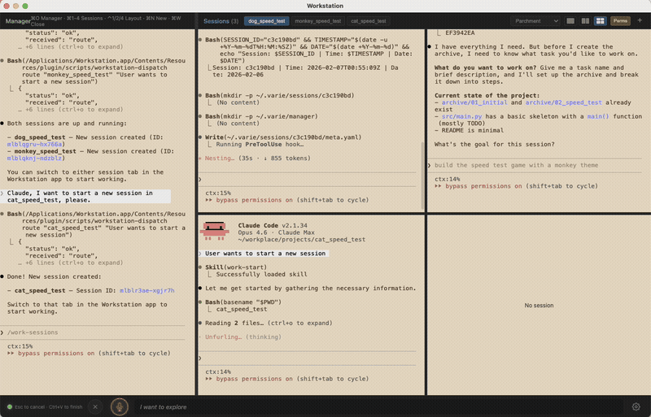
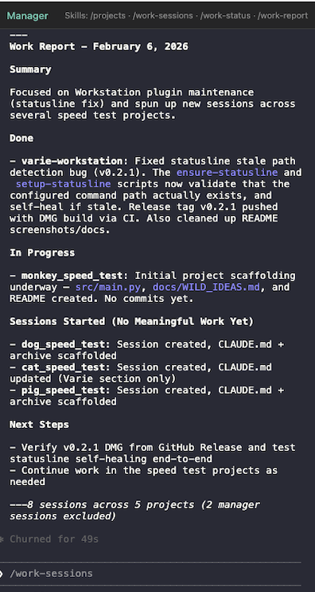
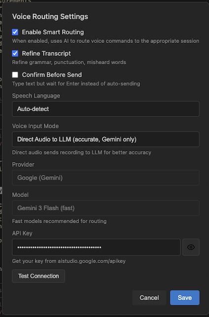

# Workstation

Multi-session orchestration for Claude Code with voice control.



<p>
  
  
</p>

*Work reports for standups · Voice routing settings*

Built for those who love to build.

---

## Features

### Session Management & Orchestration
- **Multi-session terminals** — Run multiple Claude Code sessions side-by-side
- **Smart routing** — Auto-dispatch commands to the right session by repo name, task ID, or context
- **Manager session** — Central terminal for cross-project commands
- **Project discovery** — Auto-detect repos and track work progress

### Project Management
- **Work reports** — Generate human-readable summaries for standups, team syncs, and manager updates
- **Checkpoints** — Save and resume structured work state across sessions
- **Handover docs** — Session handovers with resume prompts so nothing gets lost

### Voice Control
- **Apple Speech** — Fast, offline speech recognition (macOS)
- **LLM-powered routing** — Gemini/Claude/GPT transcribes and routes voice commands to the right session
- **Hands-free dispatch** — Speak naturally: "continue the character API work"

## Installation

**Requirements:** macOS 12+, [Claude Code CLI](https://docs.anthropic.com/en/docs/claude-code)

### Option A: Download the app (recommended)

The desktop app bundles the plugin — no separate plugin install needed.

1. Download from [GitHub Releases](https://github.com/varie-ai/workstation/releases):
   - **macOS (Apple Silicon):** `*-arm64.dmg`
   - **macOS (Intel):** `*-x64.dmg`

2. Open the DMG and drag **Workstation** to Applications.

3. Launch the app. All Claude Code sessions started from Workstation automatically have the plugin skills available.

> **macOS Gatekeeper:** If macOS blocks the app on first launch:
> - **macOS 14 and earlier:** Right-click the app > Open > click Open
> - **macOS 15 (Sequoia):** System Settings > Privacy & Security > "Open Anyway"

### Option B: Install the plugin first

If you prefer to start with the Claude Code plugin (adds skills to standalone Claude Code sessions too):

```
/plugin marketplace add https://github.com/varie-ai/workstation
/plugin install varie-workstation@varie-workstation
```

Restart Claude Code. The Workstation app downloads and launches automatically on your next session. To disable: `/workstation autolaunch off`

### Build from source

```bash
git clone https://github.com/varie-ai/workstation.git
cd workstation
npm install
npm run dev
```

## Privacy

Workstation runs entirely on your machine. No telemetry, no analytics, no data sent to any third party.

- **All state is local** — Checkpoints, session data, and configuration live in `~/.varie/` on your filesystem. Nothing is synced or uploaded.
- **Voice (Apple Speech)** — Processed on-device by macOS. Audio never leaves your machine.
- **LLM smart routing (opt-in)** — If you enable voice routing via an LLM provider (Gemini, Claude, GPT), your voice transcript and project repo names are sent to the provider you choose, using your own API key. This feature is off by default.

## Quick Start

### Session Workflow
```bash
# From Manager terminal
/work-sessions          # See all active sessions
/route "my-app" "fix the auth bug"  # Route to matching session
/dispatch abc123 "run tests"       # Send to specific session

# From any session
/work-start myrepo feature-x       # Start tracking work
/work-checkpoint                   # Save progress
/work-report                       # Generate standup summary
/work-handover                     # Generate handover doc
```

### Voice Control Setup
1. Click the gear icon in Workstation
2. Select your speech engine and voice routing mode
3. Enter your API key (if using Gemini)
4. Press **Ctrl+V** or click the mic to speak

| Engine | Speed | Accuracy | Offline | Notes |
|--------|-------|----------|---------|-------|
| WhisperKit | Fast | Excellent | Yes | **Recommended for Apple Silicon.** Defaults to `base` model; we recommend selecting `large-v3-turbo` for best accuracy (~1 min first-time download + compile, ~1s load thereafter). |
| Apple Speech | Fast | Good | Yes | Built-in macOS speech recognition. No setup required. |
| Direct Audio (Gemini) | Medium | Excellent | No | Requires Gemini API key. Best for non-Apple Silicon machines. |

macOS will prompt for **Microphone** and **Speech Recognition** permissions on first use.

## Agent Setup

Control your Workstation sessions remotely from your phone via an AI agent (e.g. [OpenClaw](https://openclaw.ai)) and a messaging app (Telegram or WhatsApp).

### Quick Start

1. **Install OpenClaw** — `npm install -g openclaw` and start the gateway (`openclaw gateway start`)
2. **Connect a messaging channel** — Set up Telegram or WhatsApp in your OpenClaw config (`~/.openclaw/openclaw.json`)
3. **Restart the gateway** — `openclaw gateway restart` so it picks up the Workstation skill
4. **Send a message** — From Telegram/WhatsApp, tell your agent something like *"check the status of my-app"*. Remote mode turns on automatically.

The Workstation skill and CLI tool (`wctl`) are installed automatically every time the app launches. If you install OpenClaw after Workstation, just relaunch the app — it detects OpenClaw and registers the skill on next startup. No manual setup required.

> **Note:** The notification bridge reads your OpenClaw channel config at launch. If you install or reconfigure OpenClaw (e.g. add Telegram/WhatsApp) after Workstation is already running, relaunch Workstation so the bridge picks up the new settings.

### How It Works

```
You (Telegram/WhatsApp)
  → OpenClaw agent (understands your intent)
    → Workstation (matches to the right session by repo name)
      → Claude Code (executes your request)
        → Bridge (detects: finished, question, plan approval)
          → OpenClaw (sends notification + screenshot to your phone)
```

Sessions are identified by their **repo/project name** (e.g. `varie-workstation`, `my-app`) as shown in the Workstation tab bar. You reference sessions naturally — *"run tests in my-app"* — and the agent routes to the matching session automatically.

### Remote Mode

**Remote mode** controls whether notifications are sent to your phone.

- **Auto-enabled** — Turns on automatically when the agent dispatches or creates a session
- **Manual toggle** — Click the `Remote` button in the top bar
- Turning Remote mode off stops notifications (useful when you're back at your desk)

### Notifications

The built-in bridge watches your Claude Code sessions and notifies you when:

| Event | What you receive |
|-------|-----------------|
| **Claude finished** | Terminal output summary + screenshot of the result |
| **Plan approval** | Plan details with numbered options to approve/reject |
| **Question** | The question text with selectable options |

Screenshots are captured from the Workstation window using Electron's built-in page capture — no extra permissions needed.

**Notification rules:**
- **Remote mode ON** — Notifications sent (auto-enabled by agent commands)
- **Remote mode OFF** — No notifications (default when working locally)
- **"Always Send"** (Settings > Agent Notifications) — Always send, regardless of Remote mode

**Choosing a notification channel:**

Open Settings (gear icon) > Agent Notifications > **Notification Channel** dropdown. This lists all enabled messaging channels from your OpenClaw config (`~/.openclaw/openclaw.json`). Select which channel (Telegram or WhatsApp) should receive notifications. The dropdown auto-populates — if you add or remove channels in OpenClaw, relaunch Workstation to refresh the list.

### Interacting from Your Phone

**Checking active sessions:**
- *"what sessions are running?"* — The agent lists all active sessions with their repo name, task, last active time, and what they're currently working on
- This is a good first step if you're not sure which session to target

**Sending commands:**
- *"check the auth bug in my-app"* — Routes to the session matching "my-app" by repo name
- *"create a new session for varie-workstation and fix the login bug"* — Creates a new session if none exists
- You never need to know session IDs — just use the project/repo name shown in the tab bar

**Answering questions and plan approvals:**
- For simple choices (1, 2, 3…), reply with the option number
- For complex or multi-line answers, say **"chat with claude: your detailed answer here"** — this types directly into the Claude Code input, bypassing the routing LLM so your answer is captured exactly

**Stopping execution:**
- Say **"escape"** or **"interrupt"** to stop the current Claude Code operation (equivalent to Escape or Ctrl+C in the terminal)

### On-Demand Screenshots

The agent can request screenshots at any time via the Workstation skill:

| Mode | What it captures | Permission needed |
|------|-----------------|-------------------|
| **Session** (default) | The Workstation app page, focused on a specific session | None (Electron built-in) |
| **Screen** | Your entire display or a specific monitor | macOS Screen Recording |

To enable full-screen screenshots: **System Settings > Privacy & Security > Screen Recording > enable Workstation**, then restart the app.

### Troubleshooting

| Issue | Fix |
|-------|-----|
| Agent doesn't know about Workstation skill | Restart the OpenClaw gateway — skills load at startup |
| Skill still not found after restart | Relaunch Workstation so it re-registers the skill, then restart the gateway |
| No notifications received | Check Remote mode is on (green `Remote` button in top bar) |
| Screenshots missing from notifications | Notifications use Electron page capture (no permission needed). For full-screen screenshots, grant Screen Recording permission. |
| Agent routes to wrong session | Be specific with the repo name: *"run tests in varie-workstation"* |
| No notifications after setting up OpenClaw | Relaunch Workstation — the bridge reads OpenClaw channel config at startup |

## Skills Reference

| Skill | Description |
|-------|-------------|
| `/work-start` | Initialize task tracking with context loading |
| `/work-checkpoint` | Save structured work state |
| `/work-resume` | Resume previous work via fuzzy matching |
| `/work-recover` | Compare checkpoint vs reality after crash |
| `/work-status` | Show all active tasks across repos |
| `/work-report` | Generate work reports for standups and team syncs |
| `/work-handover` | Generate session handover documentation |
| `/work-summarize` | Quick summary of current session state |
| `/work-sessions` | List all active sessions |
| `/work-stats` | Show token usage statistics |
| `/route` | Auto-route message to best matching session |
| `/dispatch` | Send message to specific session by ID |
| `/projects` | Show all projects with status |
| `/project` | Deep dive into a specific project |
| `/discover-projects` | Scan for new repos and add to index |
| `/workstation` | Configure settings (autoLaunch, skip-permissions) |

## Configuration

```yaml
# ~/.varie/config.yaml
autoLaunch: true  # Auto-start with Claude Code
```

LLM/voice settings are managed through the in-app settings panel.

## Development

```bash
npm install       # Install dependencies
npm run dev       # Development mode (Electron)
npm run test      # Run tests
npm run package:mac  # Build for distribution
```

## License

MIT

---

[GitHub](https://github.com/varie-ai/workstation) · [Varie AI](https://varie.ai)
